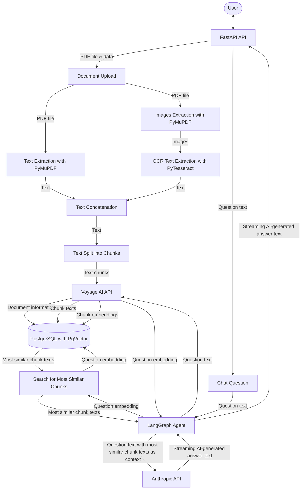
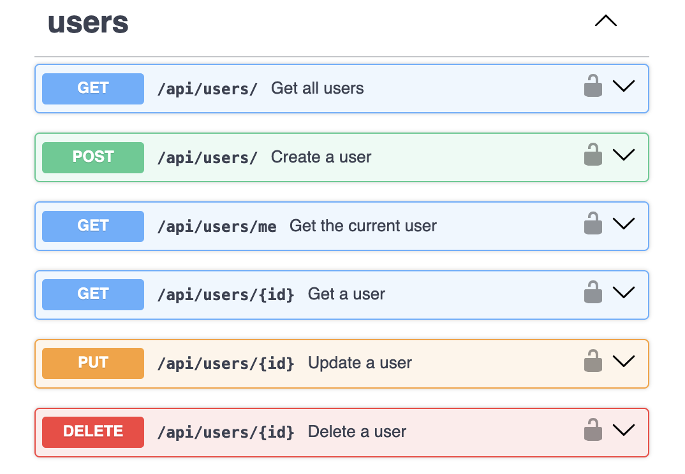
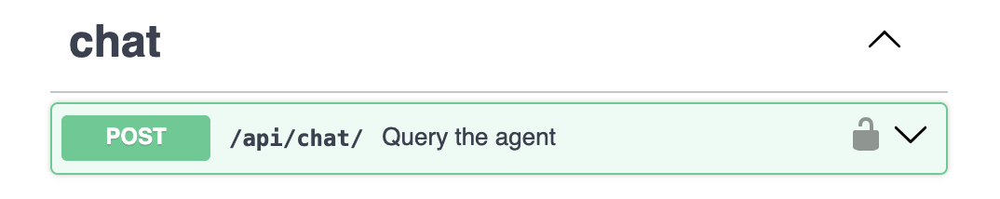

# Team Copilot


Team Copilot is a chatbot application that aims to help the members of a team do their
work by managing a set of PDF documents and replying to questions about the documents.
The application is written in Python and has a FastAPI based API with endpoints for
authentication, uploading documents and making questions.

The application has a **LangGraph** based agent that manages the chats and uses a remote
**embedding model** from [Voyage AI](https://www.voyageai.com) and a remote
**LLM model** from [Anthropic](https://www.anthropic.com). Therefore, a Voyage AI API
key and an Anthropic API key are required to run the agent.

The application uses the **PyMuPDF** and **PyTesseract** Python libraries to extract the
text of the PDF documents. PyMuPDF is used to extract plain text and images and
PyTesseract is used to extract text from the previously extracted images through OCR
(Optical Character Recognition). The extracted text of each document is stored in a
**PostgreSQL** database configured as a vector database with the **PgVector** PostgreSQL
extension.

Author: Jose A. Jimenez.

## Data Flow Diagram



## Document Processing Flow

Each time a PDF document is uploaded to the application, the following steps are
performed:

1. A new document record is inserted in the database, with "pending" status.
2. The PDF document is uploaded to a temporary path in the file system.
3. The status of the database document record is updated to "processing".
4. The text and images of the document are extracted with PyMuPDF.
5. For each extracted image, if the image contains text, the text is extracted with
   PyTesseract.
6. The complete extracted text is split into chunks.
7. For each text chunk, the embedding (vector of numbers) of the chunk is generated
   with the remote Voyage AI embedding model.
8. For each text chunk, a new document chunk record is inserted in the database,
   including the chunk text and the chunk embedding.
9. The status of the database document record is updated to "completed". If any error
   happens during the previous steps, the status is updated to "failed".
10. The uploaded PDF document is deleted.

## Question Answering Flow

Each time a question is asked to the application, the following steps are performed:

1. The agent converts the question text to an embedding (vector of numbers) with the
   remote Voyage AI embedding model.
2. The agent searches for the embeddings of the document chunks stored in the database
   that are the most similar embeddings to the question embedding. The search is done by
   calculating the cosine distance between two vectors, where the vectors are any of the
   document chunk embeddings and the question embedding. The smaller the cosine distance
   between two vectors is, the more similar the vectors are.
3. The agent retrieves the text of the most similar document chunks found and
   concatenates it into a single text.
4. The agent sends the question text, and the text of the most similar document chunks
   found as a context, to the remote Anthropic LLM model.
5. The agent returns the response of the LLM model in streaming, which is returned by
   the application as well.

## How to Run

### For Development

You can work with the project and run it inside a dev container if you use Visual Studio
Code as your IDE. For this, you need to copy the `.env-app-template` file as `.env-app`
and copy the `.env-db-template` file as `.env-db`. Then, you need to set your own values
for the environment variables in the `.env-app` and `.env-db` files. Finally, you need
to build the dev container and open the project inside the container using the Visual
Studio Code options.

This will set up the following containers:

- An application container (the main dev container)
- A PostgreSQL database container
- An Adminer (database management web user interface) container

### For Production

You can run the project in a production-ready container. You have two options:

1. Using the Docker Compose configuration for running an application container, a
   database container and a database UI container (useful for running the project
   locally).
2. Using the Dockerfile configuration for running just an application container (relying
   on an external database).
   
For any of the options, first follow the same steps than for the environment variables
mentioned in the *For Development* previous section.

#### Running an Application Container, a Database Container and a Database UI Container

Build the Docker images and create and run the containers:

```bash
docker compose up -d
```

This will set up the following containers:

- An application container
- A PostgreSQL database container
- An Adminer (database management web user interface) container

#### Running Just an Application Container

Build the Docker image:

```bash
docker build -t team-copilot:latest .
```

Create and run the application container:

```bash
docker run -d \
  --name team-copilot-app \
  -p 8000:8000 \
  --env-file .env-app \
  team-copilot:latest
```

## Documentation User Interface Screenshots

<br>
<br>
<br>
<br>
<br>
<br>

